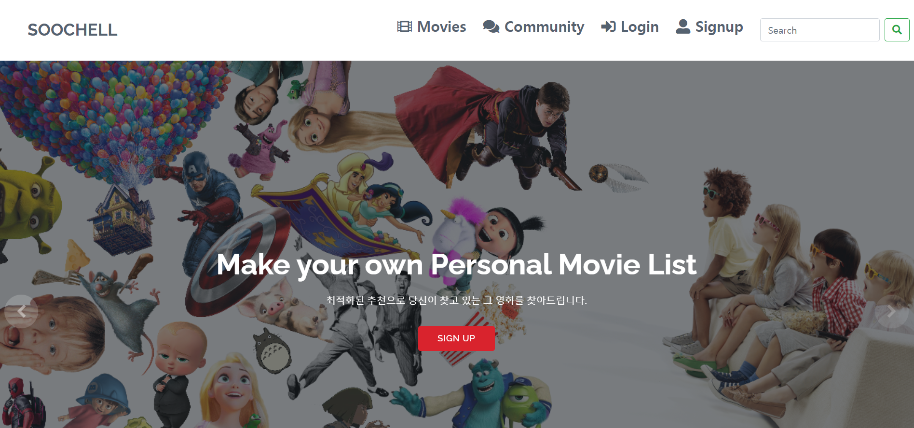

# README

[toc]

## 프로젝트 결과

- 메인페이지



- 메인페이지 옆 오늘의 영화 보여줌


- 메인페이지의 `SIGN UP`버튼을 누르면 아래 SIGNUP 페이지로 슬라이드해서 내려감


- 회원가입을 한 뒤, 선호하는 컨텐츠를 선택(추천 알고리즘에 사용됨)


- 선택을 한 장르별 추천을 해줌


- VOD의 세부페이지(영화 상세내용, 출연진, 리뷰, 유사영화추천을 보여줌)


- 검색기능(ex. `해리` 검색결과)


- Community기능


- Community 상세 페이지, 댓글도 달수있음


## (기획)기본틀

### 주제 : 들어오면 무조건 3개는 가져간다

### 추천 -> 리뷰(정보) -> 커뮤니티

#### 1. 추천

- 날씨
- 오늘 가장많이 클릭한 영화
- 사이코패스가 좋아하는 영화
- 내가 좋아하는 평론가들이 추천한 영화
- 내가 좋아하는 장르
- mbti별 추천 
- 나랑 닮은 유명인이 나오는 영화 추천


#### 2. 리뷰(정보)

- 사이트처럼 해당 영화의 평론가들의 리뷰들 사이트로 이동하게 만듦
- 그 페이지에 간단한 예고편과 배우들 사진 과 간단한 정보정도
- 트레일러 등


#### 3. 커뮤니티

- 사람들끼리 영화에 관한 대화를 하고
- 서로 추천도 함(믿음이..ㅎ)


## 스토리보드

### S1.

이런sthttps://tinder.com/?lang=ko


오른쪽으로 스와이프 => (무조건 건져 st)

계정 만들기 => Signup

메뉴(드롭박스) => 커뮤니티, 추천, 정보


### S2.Signup


이름, id. pw, email 


### S3. continue을 누르면 유저 취향 정보 파악 

 S3-1좋아하는 장르 - 여러개중에 고르게 함(3개 이상 골라야 넘어감)

S3-2좋아하는 영화 - 100개 이미지 중에 고르게 함(3개 이상 골라야 넘어감)

S3-3좋아하는 배우 - 한국 탑 30, 할리우드 탑 30 고르게 함 (3개 이상 골라야 넘어감)

S3-4. **내가 좋아하는 영화를 평점 높게 준 평론가들이 추천하는 영화를 추천함**


### S4. 영화 정보(S3-4에서 추천된 영화 3개의 이미지가 뜸)

그 중에 하나를 클릭하면 영화 정보 페이지로 넘어갈 수 있음


영화제목, 개봉연도, 감독, 배우, 시놉시스, 예고편

평론가 리뷰 10개(링크로 연결) + 만약 된다면 언어 번역


_________________


## 0. 기본기능

| 기능                | url                                | method | req                                                          | res                                          |
| ------------------- | ---------------------------------- | ------ | :----------------------------------------------------------- | -------------------------------------------- |
| Signup              | /acccounts/signup/                 | POST   | {username,passwordl}                                         | {username} signup이 잘되면 username을 return |
| Login               |                                    |        |                                                              |                                              |
| Logout              |                                    |        |                                                              |                                              |
| review 조회(인덱스) | /reviews/                          | GET    |                                                              | [{id, category, content, username, date }]   |
| review detail       | /reviews/:id/                      | GET    | [{id, category, content, username, date }]                   | [{id, category, content, username, date }]   |
| review 추가         | /reviews/create/                   | POST   | {category, content}<br />POST방식으로 들어온 데이터를 백에다가 저장해달라고 요청, 그리고 요청이 이루어지면, 응답으로 우리가 원하는 데이터를 백에서 받아옴(시리얼라이저로 걸러서 줌) | {id, category, content, username, date }     |
| review 삭제         | /reviews/:id/delete/               | DELETE |                                                              |                                              |
| review 수정         | /reviews/:id/update/               | PUT    | {id,category,content}                                        | 수정된 {id, category,content}                |
| comment 추가        | /reviews/:id/comments/             | POST   | {content,}                                                   | {comment_id,review_id, content}              |
| comment 삭제        | /reviews/:id/comments/:comment_id/ | DELETE |                                                              |                                              |
| Like                | /reviews/:id/like/                 | POST   | {username,id}                                                | {모름 username???}                           |
| follow(된다면)      |                                    |        |                                                              |                                              |
| movie 조회          | /moives/                           | GET    | json,프로젝트때 카드                                         |                                              |
| movie 상세          | /movies/:id/                       | GET    |                                                              |                                              |
|                     |                                    |        |                                                              |                                              |
|                     |                                    |        |                                                              |                                              |
|                     |                                    |        |                                                              |                                              |
|                     |                                    |        |                                                              |                                              |
|                     |                                    |        |                                                              |                                              |
|                     |                                    |        |                                                              |                                              |
|                     |                                    |        |                                                              |                                              |


## 1.커뮤니티

메인 페이지


상세 페이지

> 좋아요


댓글 


글쓰기(create)


## 2. 영화 정보

영화 정보 카테고르 누르즈마자 들어가자마자 보이는 메인 페이지


그 중 하나 누르면 상세페이지로 이동


## 3. 영화 추천


카드타입으로 추천 카테고리가 메인페이지

굿플레이스(내가 좋아하는 평론가들이 추천한 영화) -열림과 동시에 추천 영화들이 밑으로 나열되어 있음

다른 카드 카테고리들을 누르면 추천 영화 뜸

- 날씨
- 오늘 가장많이 클릭한 영화
- 사이코패스가 좋아하는 영화
- 내가 좋아하는 평론가들이 추천한 영화
- 내가 좋아하는 장르
- mbti별 추천 
- 나랑 닮은 유명인이 나오는 영화 추천


## front-end 오류 및 해결

### 문제1. router 

- router를 깔았는데 `main.js`에 router가 import 되어있지 않아서 오류가 났다
- `npm install router` -> `vue add router`도 했는데 자동으로 적혀있지 않아서 router가 없다고 오류가 계속 나서 구글링했더니 main.js에 아래와 같이 적어줘야된다고 해서 적어줬다.
- `main.js`

```js
import Vue from 'vue'
import App from './App.vue'
// router등록하려면 적혀있어야됨
import router from './router'

Vue.config.productionTip = false

new Vue({
  // router등록하려면 적혀있어야됨
  router,
  render: h => h(App),
}).$mount('#app')
```


### 문제2. User오류 왜 자꾸 날까?

> 로그인도 되고, User db에도 데이터가 있는데 CreateReview를 하려고 하면 자꾸 User가 Anonymous라고 뜬다....ㅠ


&#9989; 고쳤다!!!! `ReviewCreate.vue`에서 data를 넘겨줄 때 배열에 담아서 넘겨줬는데  server에서도 serializer고침(user 뺌..) 

원래는 headers를 config로 줬는데 일단 바로 주는 거로 바꾸고, serializer도 고치고 하니까 작성이 잘 됐다! 근데 문제가 작성이 되고 router로 id를 params로 전달해줘야되는데 전달이 잘 안되고 NAN으로 뜬다..그래서 그냥 ReviewList로 넘김

```js
addReview(event){
      event.preventDefault()
      // const config = this.setToken()
      // console.log('컨피그다',config)
      axios({
        url:'http://127.0.0.1:8000/reviews/',
        method:'POST',
        data:{
            title:this.title,
            content : this.content,
            category : this.category,
        },
        headers:{
          Authorization:`JWT ${localStorage.getItem('jwt')}`
        },
      }).then((res)=>{
        console.log('reviewCreatet성공?',res.data)
        this.$router.push({name:'ReviewList'})

      }).catch((err)=>{
        console.error('에러라고오오',err)
      })
```

&#9989; 여기서 아직도 review생성시 바로 해당 review의 id로 가는걸 못하겠따,,,


### like 안됨...


## front-end 배운점

### 1. router 컴포넌트에 props전달

### router 컴포넌트에 props전달

> [참고문헌](https://router.vuejs.org/kr/guide/essentials/passing-props.html)
>
> 컴포넌트에서 `$route`를 사용하면 특정 URL에서만 사용할 수 있는 컴포넌트의 유연성을 제한하는 라우트와 강한 결합을 만든다.
>
> 컴포넌트와 라우터 속성을 분리하려면 다음과 같이 하십시오.
>
> **$route에 의존성 추가**
>
> ```js
> const User = {
>   template: '<div>User {{ $route.params.id }}</div>'
> }
> const router = new VueRouter({
>   routes: [
>     { path: '/user/:id', component: User }
>   ]
> })
> ```
>
> **속성에 의존성 해제**
>
> ```js
> const User = {
>   props: ['id'],
>   template: '<div>User {{ id }}</div>'
> }
> const router = new VueRouter({
>   routes: [
>     { path: '/user/:id', component: User, props: true },
>   ]
> })
> ```
>
> 이를 통해 어디서나 컴포넌트를 사용할 수 있으므로 컴포넌트 재사용 및 테스트하기가 더 쉽습니다.
>
> ### Boolean 모드
>
> `props`를 `true`로 설정하면 `route.params`가 컴포넌트 `props`로 설정됩니다.
>
> ### 객체 모드
>
> `props`가 객체일때 컴포넌트 `props`가 있는 그대로 설정됩니다. `props`가 정적일 때 유용합니다.
>
> ```js
> const router = new VueRouter({
>   routes: [
>     { path: '/promotion/from-newsletter', component: Promotion, props: { newsletterPopup: false } }
>   ]
> })
> ```
>
> ### 함수 모드
>
> `props`를 반환하는 함수를 만들 수 있습니다. 이를 통해 전달인자를 다른 타입으로 캐스팅하고 적정인 값을 라우트 기반 값과 결합됩니다.
>
> ```js
> const router = new VueRouter({
>   routes: [
>     { path: '/search', component: SearchUser, props: (route) => ({ query: route.query.q }) }
>   ]
> })
> ```
>
> `/search?q=vue`는 `{query: "vue"}`를 `SearchUser` 컴포넌트에 전달합니다.
>
> 라우트 변경시에만 평가되므로 `props` 함수는 상태를 저장하지 않도록 합니다. `props`를 정의할 상태가 필요한 경우 래퍼 컴포넌트를 사용하면 상태가 변경될 때마다 응답할 수 있습니다.

공식문서를 참고해서 해봤다! 

reviewList에서 reviewItem으로 갈때 id값으로 router가 이동은 되지만 해당 reviewItem에서 data를 쓰려면 props로 넘겨줘야되는데 방법을 몰라서 구글링을 했더니, 위와 같은 여러 방법들이 있는데 나는 그중에 함수로 전달하는 것을 해봤다.

✔️ **props로 전달하지 않아도 id값을 받는 방법**

```vue
template>
  <div class="product">
    <h1>상품 정보</h1>
    <p>이 페이지는 ID.{{ $route.params.id }}의 상세를 출력합니다.</p>
  </div>
</template>
```

`{{ $route.params.id }}` 이거로 props로 전달하지 않아도 id값을 받을 수 있지만 type을 찍어봤더니 `String`값이 나왔다.

reviews를 get방식으로 서버에서 불러온다고 해도, review.id는 number라 `==`동등연산자로 계산하면 굳이 props로 전달하지 않고 아래와 같이 쓸수 있지만, 나는 `===`일치연산자를 쓰고 싶어서  props로 id값을 Number로 받아왔다.

✔️ **`{{ $route.params.id }}` 사용해서 review data가져오는 법 **

> id값을 이용해 reviews에서 id값이 동등(숫자와 문자이지만 숫자형 문자는 같다고 인식함)하는 것을 가져옴!

```vue
<script>
import axios from 'axios'
export default {
  data(){
    return {
      review:{}
    }
  },
  created(){
    const reviewId = this.$route.params.id
    axios.get('http://127.0.0.1:8000/reviews/')
      .then((res) => {
        res.data.forEach((review)=>{
          if (review.id == reviewId){
            this.review = review
          }
        })
      })
      .catch((err) => {
        console.log(err)
      })
  },
}
</script>
```


✔️ **매개 변수를 props로 컴포넌트에 전달하기 **

`router > index.js`

```js
...
const routes = [
 ...
  {
    path: '/reviews/:id',
    name: 'ReviewItem',
    component: ReviewItem,
    //아래 내용 추가, 해당 route에 props로 id값을 Number type으로 넘겨줌
    // 함수로 지정하면 첫 번째 매개변수로 현재 라우트 객체를 사용할 수 있음
    props: route => ({
      id: Number(route.params.id)
    })
...
```

- `views > ReviewItem.vue`

> id값을 이용해 reviews에서 id값이 일치하는 것을 가져옴!
>
> 동등연산자는 언제 오류가 날지 모르니 일치 연산자로 확실하게 하기위해 이렇게 했다!

```vue
<script>
import axios from 'axios'
export default {
  // id를 라우터로 보낸 props
  props:{
    id:Number,
  },
  data(){
    return {
      review:{}
    }
  },
  created(){
    const reviewId = this.$route.params.id
    console.log(reviewId)
    axios.get('http://127.0.0.1:8000/reviews/')
      .then((res) => {
        res.data.forEach((review)=>{
          if (review.id === this.id){
            this.review = review
          }
        })
      })
      .catch((err) => {
        console.log(err)
      })
  },
}
```


✔️ **프로그래밍 방식 네비게이션 **

>`router.push(location, onComplete?, onAbort?)`
>
>**Vue 인스턴스 내부에서 라우터 인스턴스에 `$router`로 액세스 할 수 있다. **
>
>**그러므로`this.$router.push`를 사용 할 수 있다**

다른 URL로 이동하려면 `router.push`를 사용해라

| 선언적 방식               | 프로그래밍 방식    |
| ------------------------- | ------------------ |
| `<router-link :to="...">` | `router.push(...)` |

전달인자는 문자열 경로 또는 로케이션 디스크립터 객체가 될 수 있다.

```js
// 리터럴 string
router.push('home')

// object
router.push({ path: 'home' })

// 이름을 가지는 라우트
router.push({ name: 'user', params: { userId: 123 }})

// 쿼리와 함께 사용, 결과는 /register?plan=private 입니다.
router.push({ path: 'register', query: { plan: 'private' }})
```


### 2. Vuetify 이용

> **Vue CLI 와 Vuetify.js 소개**
>
> Vue CLI 는 Vue.js 를 생성, 관리, 실행할 수 있는 Command Line Interface 이다.
>
> Vue CLI 를 사용하면 Webpack, Babel, Lint, TypeScript, Vue Router, Vuex 등의 다양한 피쳐들을 선택해서 프로젝트를 생성할 수 있다.
>
> 이번 프로젝트는 Vue CLI 를 사용해서 SPA(Single Page Application)을 생성하고 빌드하도록 한다.
>
> Vuetify는 Vue.js를 위한 개발된 디자인 프레임워크이다.
>
> Vue.js로 프로젝트를 진행할때 Vuetify 를 사용하면 손쉽게 아름다운 디자인을 적용할 수 있다.
>
> Vuetify는 머터리얼 디자인 스펙 (Material Design Spec) 을 준수한다.

```sh
vue add vuetify
```

**선택옵션에서는 “Default”를 선택하도록 한다**

```sh
? Choose a preset: (Use arrow keys)
❯ Default (recommended) 
Prototype (rapid development) 
Configure (advanced) 
```


**[vuetify 홈페이지](https://vuetifyjs.com/ko/components/api-explorer)에서 추가하고 싶은 Component를 찾기**


**그리드시스템**

`v-container`는 전체 너비를 기준으로 화면에 출력될 컨테이너를 중앙에 배치한다. `v-layout`은 섹션을 구분하는데 사용하고 `v-flex`를 포함한다. 대부분의 경우 `v-layout`의 `row`와 `column`을 주로 사용한다. `v-flex`의 내부에는 `div` 태그를 사용해서 필요한 내용을 추가한다.


✔️  **MovieGenre 선택**


```vue
 <v-card-title>Select Genre</v-card-title>
        <v-divider></v-divider>
        <v-card-text style="height: 300px;">
          <v-radio-group
            v-model="dialogm1"
            column
            multiple
          >
            <v-radio
              label="Adventure"
              value="adventure"
            ></v-radio>
            <v-radio
              label="Fantasy"
              value="fantasy"
            ></v-radio>
              
              ...
```


### Uncaught SyntaxError:Unexpected token '<'


이 에러가 자꾸나서 구글링 해보니까 `index.html` headers밑에 `<base href="/" /> `를 넣어주면 오류가 해결됨,,,


### jwt_decode

> 토큰안에 userid가 같이 들어있음

```js
import jwt_decode from "jwt-decode"
...
const token = localStorage.getItem('jwt')
        // console.log(jwt_decode(token))
        const user = jwt_decode(token).user_id
```


------------

## Django로 바꿈,,,,

### static

무료템플릿을 쓰기 위해 accounts앱에 static폴더를 만들어서 해당 무료 템플릿에서 만든 css, js,등 파일들을 넣어준다.

그 뒤에 base.html ``을 한 뒤 `<link rel="stylesheet" type="text/css" href="">` 폴더의 절대 경로만 잘 적어주면 적용이 된다!!!!

### Bootstrap form error


이건 또 무슨...색다른 에러일까...

안되다가...갑자기 된다,,,ㅎ


### QueryDict에서 값가져오기

회원가입을 할때 user가 genre들을 여러개 선택한 뒤, 그 genre의 id값을 넣어주고 싶은데 form의 data인 reques.POST를 찍어보니 QueryDict다! 회원가입을 했을때 genre fields에 값은 들어있는데 그걸 가져오는걸 어떻게 할지 몰라 찾아보니 `querydict.getlist('필드명')`로 가져올수 있었다!


