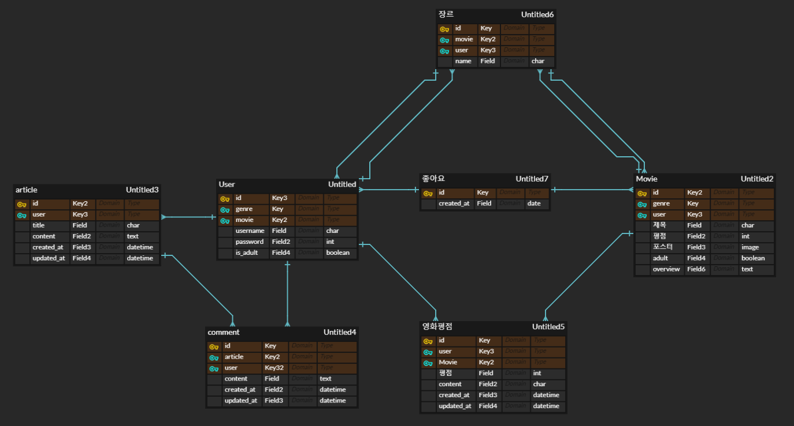

# README

1. #### 팀장 : 김학준,	팀원 : 김경수

   장고 프레임워크를 이용하여 전체적으로 같이 작업했으며, 김학준 팀장은 장르로 추천해주는 알고리즘을 김경수 팀원은 좋아요 시간에 따라 추천해주는 알고리즘을 구현했습니다. 한 사람이 알고리즘을 구현하는 동안 다른 사람은 html을 css로 꾸미는 작업을 분담하는 등 최대한 작업에 영향을 주지 않으면서 효율적으로 프로젝트 완성에 기여했습니다.

2. #### 목표 서비스 구현 및 실제 구현 정도

   사용자에게 영화에 대한 정보 및 추천 서비스를 제공하며, 커뮤니티를 통해 서로 소통할 수 있는 공간을 목표로 했습니다.

   실제 구현 정도 또한 처음 목표로 한 기능들을 모두 구현했습니다.

3. #### 데이터베이스 모델링(ERD)

   

4. #### 필수 기능

   * 관리자 페이지
   * 약 800여개의 영화 데이터베이스
   * 로그인된 사용자가 선호하는 장르의 영화들을 평점 순으로 추천
   * 여러 사용자가 좋아요를 누른 시간을 기록하여 시간에 따른 좋아요 순으로 영화 추천
   * Pagination을 활용한 커뮤니티
   * 게시글, 댓글 및 영화 평점 수정, 삭제 기능

5. #### 배포 서버 URL

6. #### 기타(느낀점)

   1학기 동안 배운 것을 종합적으로 만들게 되었는데 확실히 기억이 안나는 부분도 많았습니다.
   
   그래도 그만큼 고민하게되고 일주일동안 스스로도 실력이 많이 향상됨을 느꼈습니다. 